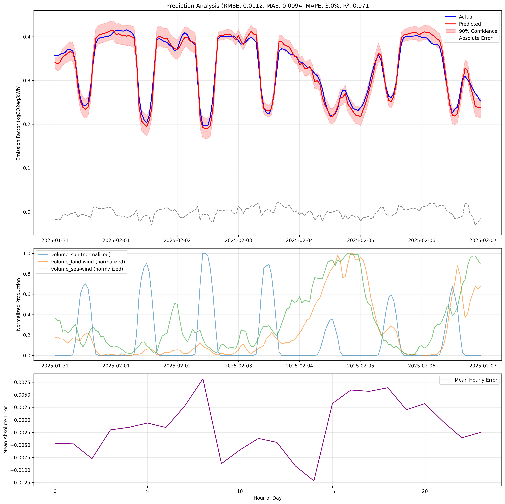
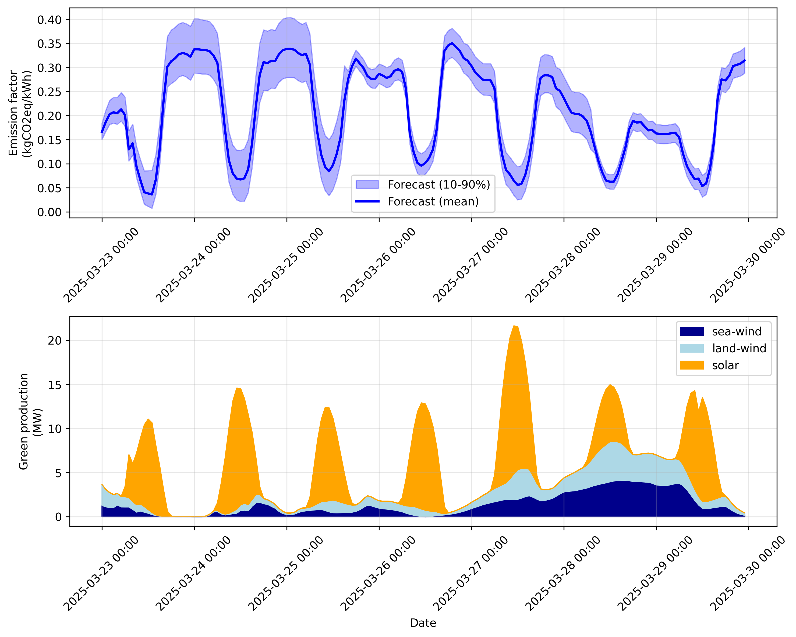

# Forecasting Grid Emission Factor for the Netherlands

This project forecasts CO2 emission factors for the Dutch electricity grid 7 days ahead. It combines historical data with renewable energy forecasts to predict how "green" the electricity grid will be.

# Model evaluation using testweek (2025-01-31 - 2025-02-06)


# Forecast for the co2 emission factor for the next 7 days (upper image) and the renewable energy forecasts (lower image)


Note that training took place on the last 180 days of data instead of the entire 5 years (see config.py).

## Project Overview

The model uses:
- Historical data from the past 5 years for training
- Last 4 weeks of data for recent context
- NED's renewable energy forecasts for the next 7 days
- Temperature data from KNMI (optional) to capture weather effects

## Directory Structure

The project creates several directories to store data and results:
- `data/`
  - `historical/`: Historical training data and context data
  - `forecasts/`: Emission factor predictions and NED renewable forecasts
  - `downloaded/`: Raw downloaded data from NED API
- `models/`: Trained AutoGluon models and performance metrics
- `knmi_data/`: Temperature data from KNMI (optional)

## Files Description

### Supporting files
- `read_ned.py`: Reads data stored on disk
  - `read_predictions`: Reads predictions from disk
  - `read_all`: Reads all data from disk
  - `read_ned`: Reads data from disk and combines it into a single pandas DataFrame
  - `read_mix_file`: Reads mix data from disk
  - `read_production_file`: Reads production data from disk

- `config.py`: Configuration for the project
  - `HISTORICAL_DIR`: Directory for historical data
  - `FORECAST_DIR`: Directory for forecast data
  - `DOWNLOADED_DIR`: Directory for downloaded data
  - `MODEL_DIR`: Directory for model data

- `knmi.py`: Process KNMI temperature data
  - Reads raw KNMI data  
  - Saves processed data to `knmi_data/processed_temperatures.csv`  
  
- `correlations.py`: Analyze correlation between historical data and temperature data
  - Reads historical data on electricity demand
  - Reads temperature data
  - Merges data on datetime
  - Plots correlation between electricity demand and temperature

### Data Collection
- `retrieve_ned.py`: Downloads data with NED API
  - Historical data for training (4 years)
  - Recent data for context (4 weeks)
  - Renewable forecasts (next 7 days)
  
- `download_historical.py`: Downloads historical data from NED API to disk  
  - Historical data for training (4 years)
  - Saves to `data/historical/`
  - Uses NED API key from environment variable `ned_api_key`
  
### Model Training
- `train_model.py`: Trains the emission factor prediction model

  - Uses AutoGluon's time series module
  - Creates features like time patterns, lags, rolling means
  - Saves model performance metrics and feature importance
  - Optional: integrates temperature data

### Prediction
- `predict.py`: Generates 7-day ahead forecasts
  - Uses recent context (4 weeks) for current trends
  - Incorporates NED's renewable forecasts
  - Produces predictions with confidence intervals

### Evaluation
- `evaluate_model.py`: Assesses model performance
  - Tests on historical data
  - Analyzes errors by time patterns
  - Generates detailed performance metrics
  - Creates error analysis plots

### Forecasting in the unknown future
- `plot_forecast.py`: Creates forecast visualizations
  - Plots predictions with confidence intervals
  - Shows renewable energy context
  - Saves plots for analysis

## Running the Project

1. Set up your NED API key:
```sh
export ned_api_key=your-key-here
```

2. Run the files in this order:
```sh
python download_historical.py # Download data
python knmi.py                # KNMI temperature data
python correlations.py        # Analyze correlation between historical data and    
                              # temperature data
python train_model.py         # Train model
python predict.py             # Make predictions
python evaluate_model.py      # Evaluate performance (test set)
python plot_forecast.py       # Visualize results (unseen data)
```

## Model Features

The model uses several types of features:
1. Temporal patterns:
   - Hour of day (0-23)
   - Day of week (Monday=0, Sunday=6)
   - Month (1-12)
   - Weekend indicator

2. Renewable energy:
   - Solar production
   - Onshore wind
   - Offshore wind

3. Historical patterns:
   - Recent emission factors (1h, 2h, 3h ago)
   - Daily patterns (24h, 48h ago)
   - Weekly patterns (168h ago)
   - Rolling means (24h, 168h windows)

4. Temperature data:
   - Current temperature
   - Temperature lags
   - Temperature rolling means

## Data Sources

- Electricity data: [Nationaal Energie Dashboard](https://ned.nl/)
- Temperature data: [KNMI](https://www.knmi.nl/) (optional)

More information on the NED API is available [here](https://ned.nl/nl/api).

## TODO
Connect temperature forecast data to the model.