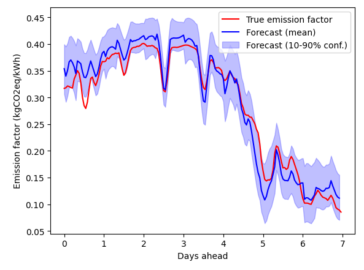

# Forecasting grid emission factor for the Netherlands

This repo contains a workflow to produce emission factor forecasts for the Dutch
electricity mix, 7 days ahead.

## Model training
Model training is performed with [AutoGluon](https://auto.gluon.ai/), using the time
series forcasting module.

As training data the total energy production and the energy mix's emission factor are
used, sourced from the [Nationaal Energie Dashboard](https://ned.nl/)
with the produced solar and wind energy as "known covariates".



*Model training result, validation on unseen data*

The NED also provides forecasts for the solar and wind production.
These are used in forecasting of the emission factor.


*Example forecast, for 2025-01-28 - 2025-02-04*

## Reproducing results

The Dockerfile contained in this reposity describes all steps you need to go
through to train a model and to produce a forecast.

The container image allows easy production of forecasts.
Docker engine is [freely available on Linux](https://docs.docker.com/engine/install/).

To run the container image do:

```docker
docker run \
    -e ned_api_key \
    --volume /local/path/to/output/dir:/data:/data \
    ghcr.io/bschilperoort/emissionfactor-forecast
```

The `/data` directory is the location where the prediction file should end up.
The container will also write the run-up data used in the prediction, as well as
NED's forecast for available wind and solar energy.

The environmental variable `ned_api_key` should be your ned.nl API key. Set this with:
```sh
export ned_api_key=enter-your-key-here
```
More information on the NED API is available [here](https://ned.nl/nl/api).

Note that the container's ouput files will be written as root. To avoid this you
can set the user ID, e.g.:
```docker
docker run \
    -e ned_api_key \
    --volume /local/path/to/output/dir:/data:/data \
    --user 1000:1000 \
    ghcr.io/bschilperoort/emissionfactor-forecast
```
If your user ID is 1000.

## Building the container image

Note that for model training, historical NED data is required, but this is removed
from the container image due to licensing restrictions. The required files are;
 - wind, zeewind, zon, electriciteitsmix .csv files
 - years 2021, 2022, 2023, 2024

These files are available from ned.nl after registering.

## ToDo:
This is a work in progress, the repository will likely be reorganized and more
descriptive documentation needs to be added.
